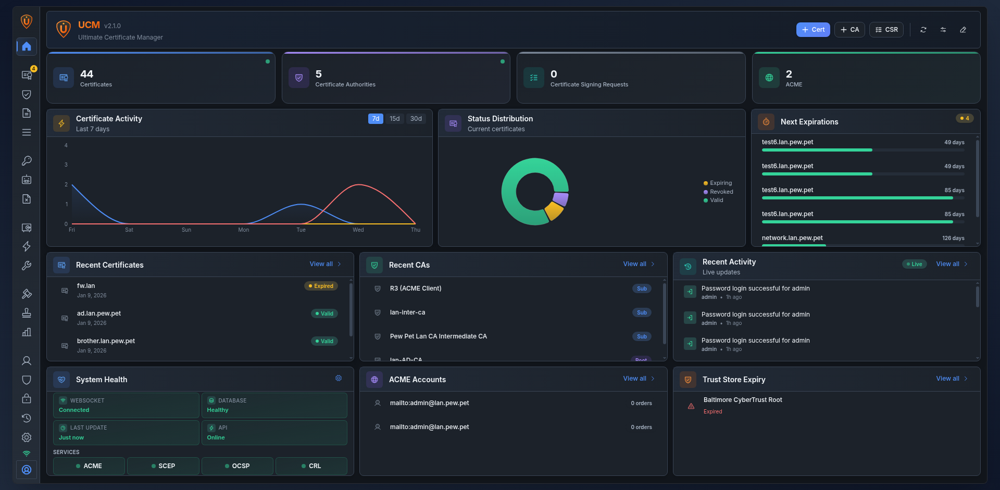

# Ultimate CA Manager


**Ultimate CA Manager (UCM)** là nền tảng quản lý Tổ chức Cấp phát Chứng chỉ (CA) trên web, hỗ trợ các giao thức PKI (SCEP, OCSP, ACME, CRL/CDP), xác thực đa yếu tố và quản lý vòng đời chứng chỉ.



---

## Tính năng

- **Quản lý CA** -- CA gốc và CA trung gian, xem phân cấp, nhập/xuất
- **Vòng đời chứng chỉ** -- Cấp phát, ký, thu hồi, gia hạn, xuất (PEM, DER, PKCS#12)
- **Quản lý CSR** -- Tạo, nhập, ký Certificate Signing Request
- **Mẫu chứng chỉ** -- Hồ sơ định sẵn cho server, client, ký mã, email
- **Hộp công cụ chứng chỉ** -- Kiểm tra SSL, giải mã CSR/cert, so khớp khóa, chuyển đổi định dạng
- **Trust Store** -- Quản lý chứng chỉ CA gốc được tin tưởng
- **Sửa chuỗi chứng chỉ** -- Kiểm tra chuỗi theo AKI/SKI với bộ lập lịch sửa tự động
- **SCEP** -- Tự động đăng ký thiết bị theo RFC 8894
- **ACME** -- Tương thích Let's Encrypt (certbot, acme.sh)
- **OCSP** -- Trạng thái chứng chỉ thời gian thực theo RFC 6960
- **CRL/CDP** -- Phân phối Danh sách Thu hồi Chứng chỉ
- **HSM** -- Đi kèm SoftHSM, hỗ trợ PKCS#11, Azure Key Vault, Google Cloud KMS
- **Thông báo Email** -- SMTP, mẫu HTML/text tùy chỉnh, cảnh báo hết hạn chứng chỉ
- **SSO** -- LDAP, OAuth2 (Azure/Google/GitHub), đăng nhập một lần SAML với ánh xạ vai trò
- **Xác thực** -- Mật khẩu, WebAuthn/FIDO2, TOTP 2FA, mTLS, API key
- **Nhật ký kiểm toán** -- Ghi nhật ký hành động với kiểm tra tính toàn vẹn và chuyển tiếp qua syslog từ xa
- **Báo cáo & Quản trị** -- Báo cáo theo lịch, chính sách chứng chỉ, quy trình phê duyệt
- **RBAC** -- 4 vai trò hệ thống (Admin, Operator, Auditor, Viewer) cùng vai trò tùy chỉnh với phân quyền chi tiết
- **6 Giao diện** -- 3 bảng màu (Gray, Purple Night, Orange Sunset) × Sáng/Tối
- **i18n** -- 9 ngôn ngữ (EN, FR, DE, ES, IT, PT, UK, ZH, JA)
- **Giao diện thích ứng** -- React 18 + Radix UI, thân thiện di động, bảng lệnh (Ctrl+K)
- **Thời gian thực** -- Cập nhật trực tiếp qua WebSocket

---

## Khởi động nhanh

### Docker

```bash
docker run -d --restart=unless-stopped \
  --name ucm \
  -p 8443:8443 \
  -v ucm-data:/opt/ucm/data \
  neyslim/ultimate-ca-manager:latest
```

Cũng có thể kéo từ GitHub Container Registry: `ghcr.io/neyslim/ultimate-ca-manager`

### Debian/Ubuntu

Tải gói `.deb` từ [bản phát hành mới nhất](https://github.com/NeySlim/ultimate-ca-manager/releases/latest):

```bash
sudo dpkg -i ucm_<version>_all.deb
sudo systemctl enable --now ucm
```

### RHEL/Rocky/Fedora

Tải gói `.rpm` từ [bản phát hành mới nhất](https://github.com/NeySlim/ultimate-ca-manager/releases/latest):

```bash
sudo dnf install ./ucm-VERSION-1.noarch.rpm
sudo systemctl enable --now ucm
```

**Truy cập:** `https://localhost:8443` hoặc `https://your-server-fqdn:8443`
**Thông tin đăng nhập mặc định:** `admin` / `changeme123` — bạn sẽ được yêu cầu đổi mật khẩu khi đăng nhập lần đầu.

Xem [Hướng dẫn Cài đặt](docs/installation/README.md) để biết tất cả các phương thức bao gồm Docker Compose và cài đặt từ mã nguồn.

---

## Tài liệu

| Tài nguyên | Liên kết |
|----------|------|
| Wiki (tài liệu đầy đủ) | [github.com/NeySlim/ultimate-ca-manager/wiki](https://github.com/NeySlim/ultimate-ca-manager/wiki) |
| Cài đặt | [docs/installation/](docs/installation/README.md) |
| Hướng dẫn Người dùng | [docs/USER_GUIDE.md](docs/USER_GUIDE.md) |
| Hướng dẫn Quản trị | [docs/ADMIN_GUIDE.md](docs/ADMIN_GUIDE.md) |
| Tài liệu API | [docs/API_REFERENCE.md](docs/API_REFERENCE.md) |
| Đặc tả OpenAPI | [docs/openapi.yaml](docs/openapi.yaml) |
| Bảo mật | [docs/SECURITY.md](docs/SECURITY.md) |
| Hướng dẫn Nâng cấp | [UPGRADE.md](UPGRADE.md) |
| Nhật ký thay đổi | [CHANGELOG.md](CHANGELOG.md) |

---

## Công nghệ sử dụng

| Thành phần | Công nghệ |
|-----------|------------|
| Frontend | React 18, Vite, Radix UI, Recharts |
| Backend | Python 3.11+, Flask, SQLAlchemy |
| Cơ sở dữ liệu | SQLite (hỗ trợ PostgreSQL) |
| Server | Gunicorn + gevent WebSocket |
| Mật mã | pyOpenSSL, cryptography |
| Xác thực | Session cookie, WebAuthn/FIDO2, TOTP, mTLS |

---

## Vị trí tệp

| Mục | Đường dẫn |
|------|------|
| Ứng dụng | `/opt/ucm/` |
| Dữ liệu & CSDL | `/opt/ucm/data/` |
| Cấu hình (DEB/RPM) | `/etc/ucm/ucm.env` |
| Nhật ký (DEB/RPM) | `/var/log/ucm/` |
| Dịch vụ | `systemctl status ucm` |

Docker: dữ liệu tại `/opt/ucm/data/` (mount dưới dạng volume), cấu hình qua biến môi trường, nhật ký ra stdout.

---

## Đóng góp

1. Fork repository
2. Tạo nhánh tính năng (`git checkout -b feature/my-feature`)
3. Commit và push
4. Mở Pull Request

---

## Giấy phép

BSD 3-Clause License kết hợp Commons Clause -- xem [LICENSE](LICENSE).

---

## Hỗ trợ

- [GitHub Issues](https://github.com/NeySlim/ultimate-ca-manager/issues)
- [GitHub Wiki](https://github.com/NeySlim/ultimate-ca-manager/wiki)